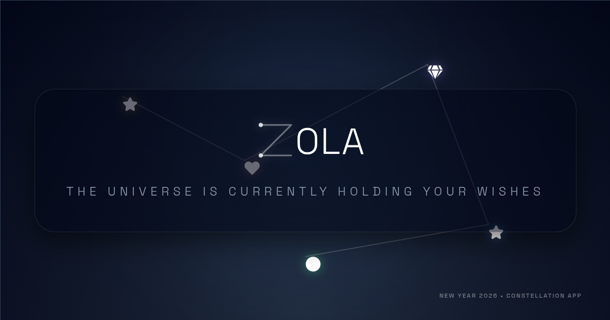

# ZOLA 🌌

> **A collaborative digital cosmos for the New Year.**

ZOLA is a real-time, interactive web experience where users create their own "Sky" and invite friends to add "Stars"—each containing a personal message. As more stars are added, the sky visually evolves, forming constellations and shifting through distinct visual phases.



## 🌟 The Vision (The Why)

I wanted to create a digital space that feels more intimate and magical than a standard messaging app. ZOLA is designed to be:
*   **Collaborative:** A shared artifact built by a community of friends.
*   **Evolving:** The visual experience rewards participation; a lonely sky transforms into a vibrant galaxy.
*   **Ephemeral yet Lasting:** Messages are locked until New Year's 2026 (configurable), turning the sky into a time capsule of wishes.

## 🚀 Key Features (The What)

### 1. Dynamic Sky System
*   **Visual Tiers:** The sky changes appearance based on the number of stars received:
    *   **Phase 01: First Spark:** Minimalist, quiet void.
    *   **Phase 02: Astral Awakening:** Blue hues, connecting lines appear.
    *   **Phase 03: Supernova Bloom:** Golden warmth, shooting stars.
    *   **Phase 04: Infinite Galaxy:** Complex nebula gradients, high density.
*   **Constellation Engine:** An MST-based (Minimum Spanning Tree) algorithm dynamically draws "organic" lines between stars, ensuring a visually pleasing graph without clutter.

### 2. Interactive Stars
*   **Customization:** Senders can choose their star's shape, color style (Gold, Blue, Fire, etc.), and an emoji icon.
*   **Message Locking:** Messages are securely stored and (optionally) visually locked until a reveal date.

### 3. Social Sharing & Artifacts
*   **Story Cards:** Uses `html-to-image` to generate high-quality, downloadable images of the constellation or individual stars, perfectly formatted for Instagram Stories or social media.
*   **Native Sharing:** Integrates with the Web Share API for seamless mobile sharing.

### 4. Atmospheric Immersion
*   **Time-Based Theme:** The background gradients shift subtly based on the user's local time (Dawn, Day, Dusk, Night).
*   **Animations:** Powered by `framer-motion` for smooth layout transitions and CSS GPU layers for performant background particle effects (drifting stars, nebulas).

## 🛠️ The Stack (The How)

*   **Frontend:** [React 19](https://react.dev/) + [Vite](https://vitejs.dev/) for blazing fast performance.
*   **Styling:** Pure CSS Modules + [Framer Motion](https://www.framer.com/motion/) for complex animations.
*   **Backend / Real-time:** [Supabase](https://supabase.com/) (PostgreSQL) for storing skies/stars and broadcasting real-time updates when new stars arrive.
*   **Utilities:**
    *   `html-to-image`: For generating shareable PNGs.
    *   `react-router-dom`: Client-side routing.
    *   `react-snowfall`: Subtle atmospheric particles.

## 📂 Project Structure

```bash
src/
├── components/       # Reusable UI elements
│   ├── Nebula.jsx    # Phase 4 background effect
│   ├── StoryCard.jsx # The downloadable image templates
│   └── TimeTheme.jsx # Handles time-of-day CSS variables
├── context/
│   └── TierContext.jsx # Manages global visual state (tiers, modals)
├── lib/
│   └── supabase.js   # Database client
├── pages/
│   ├── Home.jsx      # Landing & Sky Creation
│   ├── Sky.jsx       # The main interactive canvas (Constellations)
│   ├── Send.jsx      # Form to add a star to a sky
│   └── Demo.jsx      # Simulation mode for testing evolution
└── StarBackground.jsx # The parallax background layer
```

## ⚡ Setup & Development

1.  **Clone & Install**
    ```bash
    git clone https://github.com/your-username/zola.git
    cd zola
    npm install
    ```

2.  **Environment Variables**
    Create a `.env` file with your Supabase credentials:
    ```env
    VITE_SUPABASE_URL=your_project_url
    VITE_SUPABASE_ANON_KEY=your_anon_key
    ```

3.  **Run Locally**
    ```bash
    npm run dev
    ```
    *Note: To test native sharing on mobile, use a tunnel like `ngrok` or `localtunnel` as `localhost` is treated as insecure context by mobile browsers.*

4.  **Build**
    ```bash
    npm run build
    ```

## 🌌 Performance Optimizations

*   **Logic Separation:** Heavy background animations (`StarBackground`, `Nebula`) are decoupled from the main `Sky` component to prevent re-renders during timer ticks or interaction.
*   **CSS Composition:** Complex animations use `transform` and `opacity` with `will-change` hints to leverage the GPU compositor.
*   **Animation Pausing:** Global logic pauses expensive background rendering when modals are open to conserve battery on mobile devices.

---

*Built with ✨ for the New Year.*
